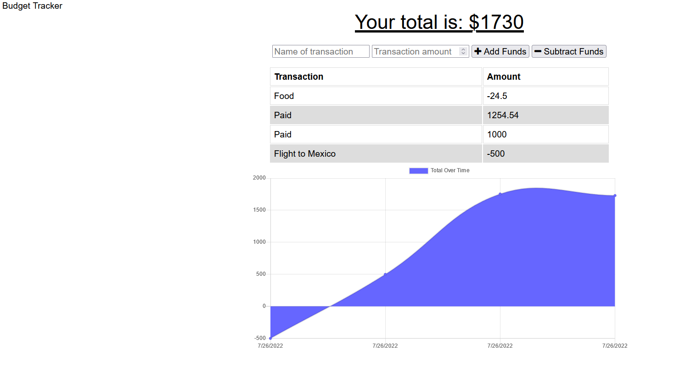

# Progressive Web Applications (PWA): Budget Tracker

## Budget Tracker
    
    Created via VSCode

    Utilizing many different node packages that allows for offline use as well as online use. 

## Description

    This tool allows users to keep track of their budget, which includes spending and costs. You can add and subtract funds as needed. It also displays a graph to make it easier to see what your spending looks like. 

Project found on [GitHub](https://github.com/TristinNguyen/PWA-Budget-Tracker)

